# VideoFetchBot

[English](README.md) | Русский

Это backend система бот + сайт с парсингом и скачиванием видео.

Основная проблема таких систем в том, что скачивание и обработка видео является долгой операцией. Это плохо, так как если выполнять такую логику прямо в HTTP-запросе, сервер начинает подвисать и не может нормально обрабатывать другие запросы.

Чтобы решить эту проблему, в проекте реализована очередь задач, worker процессы, система статусов и повторная обработка задач при ошибках.

# Архитектура

Проект состоит из нескольких частей:

- backend приложение
- Telegram бот
- worker процессы
- PostgreSQL
- очередь задач
- система статусов задач

Как правило, backend принимает запрос и ставит задачу в очередь, а worker уже выполняет долгую обработку.

# Какие проблемы решены

- Долгие операции
Это плохо, так как скачивание видео может занимать время и блокировать сервер.
Решением данной проблемы является очередь задач и отдельные worker процессы.

- Дубли задач
Это может привести к плохим последствиям, например к лишней нагрузке и повторной обработке.
Решением данной проблемы являются проверки и блокировки.

- Ошибки при обработке
Например, сеть может оборваться или сервис может перезапуститься.
Чтобы решить эту проблему, используются статусы задач и повторная постановка в очередь.

# Стек

Python, Django, Django REST Framework, PostgreSQL, Docker, Telegram API

# Для HR

Основная логика находится в следующих частях:

- backend API (site/videofetch_app/views.py)
- worker логика (videofetcher/service.py)
- работа с задачами и статусами (bot/queue_manager.py)
- Telegram бот (bot)
______________________________________________________________

ВЕБ-САЙТ
Главный веб-интерфейс >
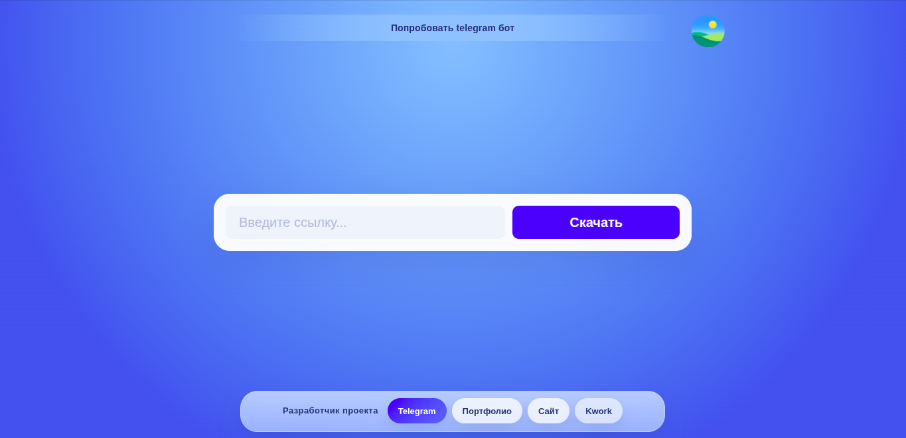

Анализ ссылки >
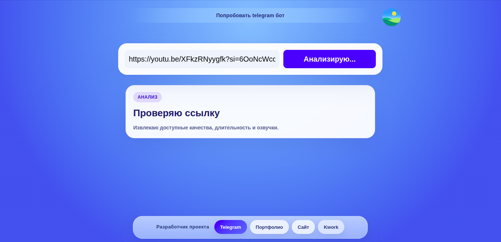

Выбор нужного качества >
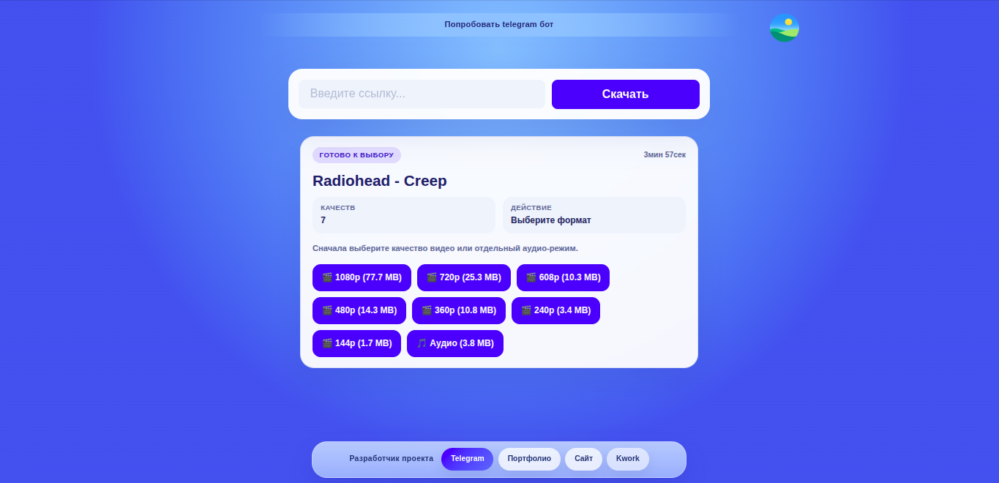

Прогресс >
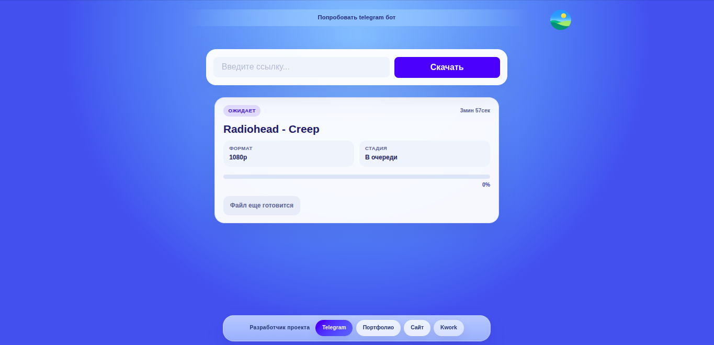

Готовый экран с предложением скачать видео/аудио >
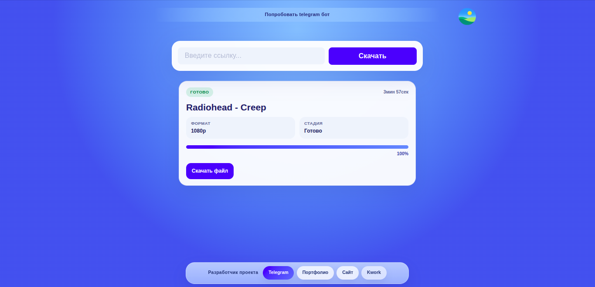
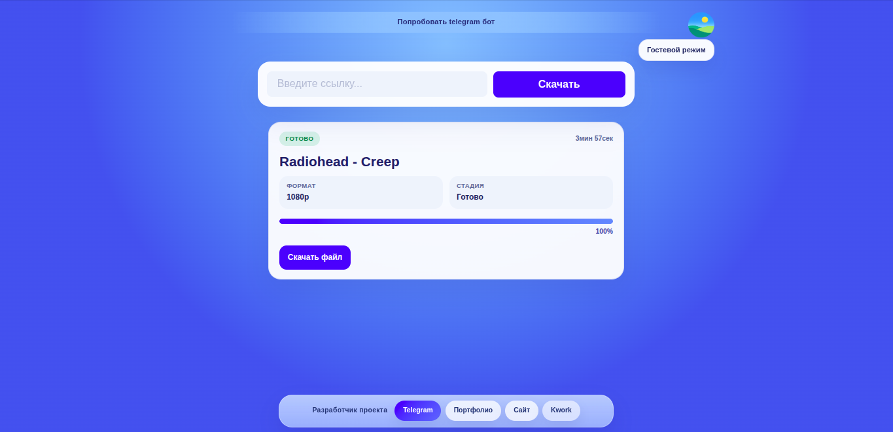

Адаптивный интерфейс >
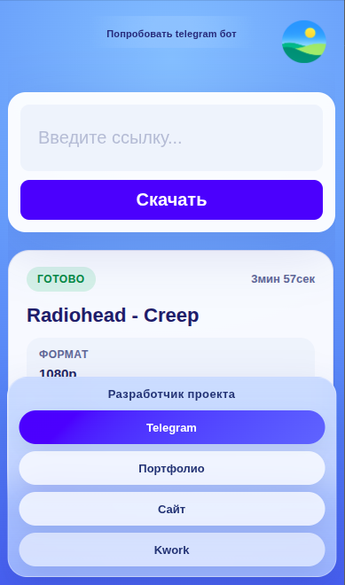
______________________________________________________________
ТЕЛЕГРАМ БОТ
Старт >
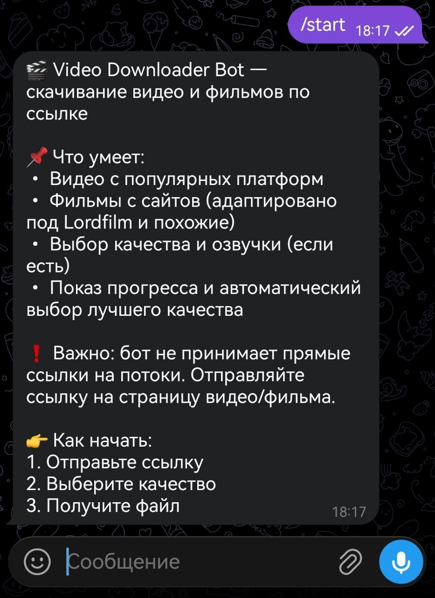

Выбор качества >
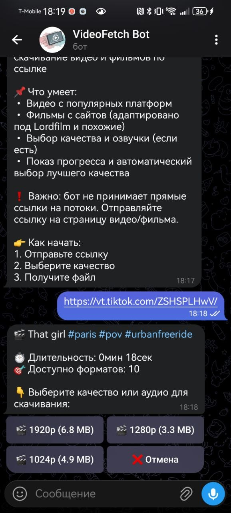

Готовое видео >
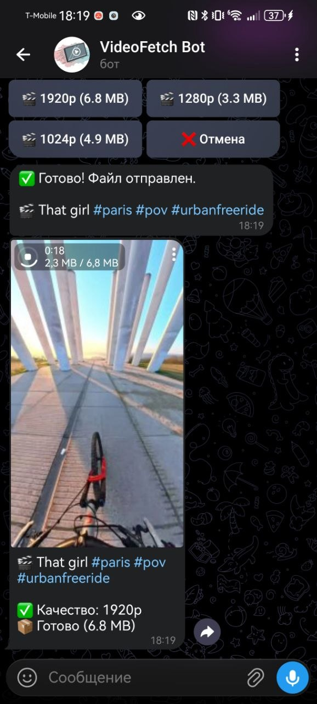

Обработка фильма >
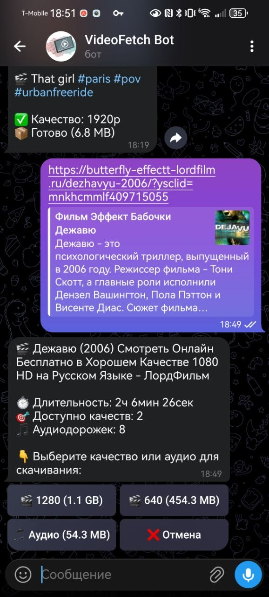

Выбор озвучки >
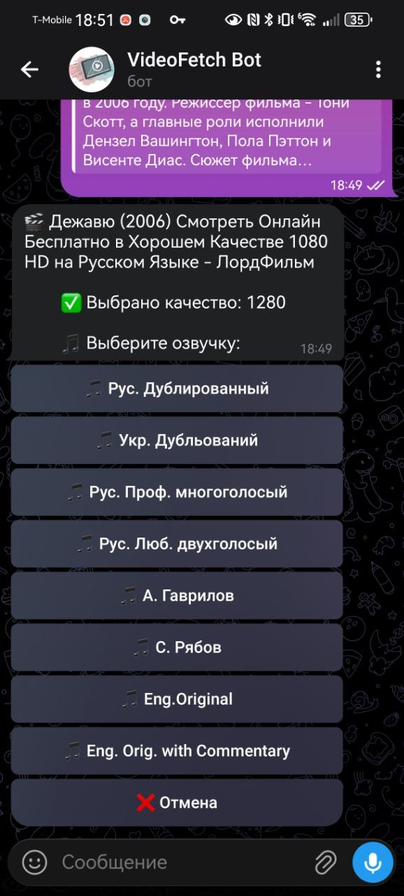

Прогресс >
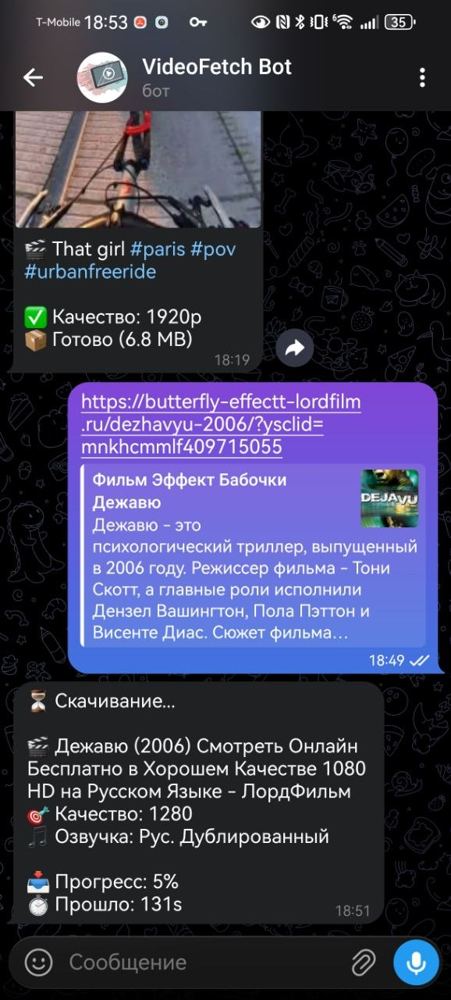

Готовое видео (превью нет, особенность телеграма) >
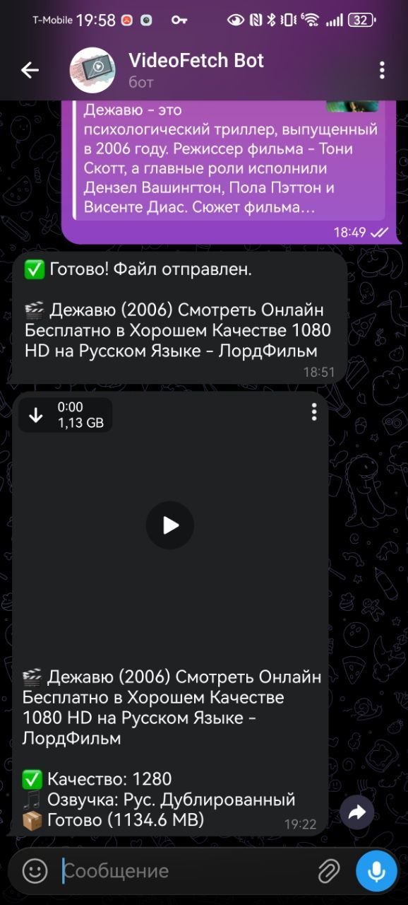
